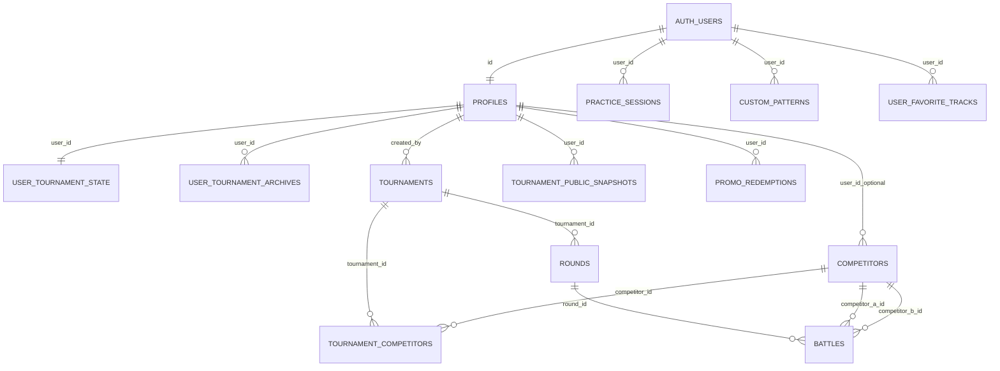

# ClashPro — modelo de datos y alineación con el producto

**Antes de cambiar schema, RLS, tablas documentadas o flujos que lean/escriban Supabase:** leer y actualizar este archivo y [`supabase-security.md`](supabase-security.md).

Documento vivo: refleja migraciones en `supabase/migrations/` y uso actual en `src/` (enero 2026). Objetivo de producto: **ecosistema por cuenta**; **bailarín (`COMPETITORS`) ≠ usuario**; **historial de rondas** (cuándo, contra quién) sin exigir cuenta al bailarín.

Consistencia visual: [`../DESIGN.md`](../DESIGN.md).

---

## 0. Estándar ClashPro — nombres canónicos (documentación)

En **documentación, reglas Cursor, issues y revisiones** usamos identificadores en **MAYÚSCULAS_SNAKE** como **entidad canónica**. Son **equivalentes 1:1** al identificador Postgres en `public` (o `auth` donde aplique) en **minúsculas** que usa el código y las migraciones.

| Canónico (doc) | Postgres / Supabase |
|----------------|---------------------|
| `AUTH_USERS` | `auth.users` |
| `PROFILES` | `public.profiles` |
| `COMPETITORS` | `public.competitors` |
| `TOURNAMENTS` | `public.tournaments` |
| `TOURNAMENT_COMPETITORS` | `public.tournament_competitors` |
| `ROUNDS` | `public.rounds` |
| `BATTLES` | `public.battles` |
| `USER_TOURNAMENT_STATE` | `public.user_tournament_state` |
| `USER_TOURNAMENT_ARCHIVES` | `public.user_tournament_archives` |
| `PRACTICE_SESSIONS` | `public.practice_sessions` |
| `CUSTOM_PATTERNS` | `public.custom_patterns` |
| `TOURNAMENT_PUBLIC_SNAPSHOTS` | `public.tournament_public_snapshots` |
| `USER_FAVORITE_TRACKS` | `public.user_favorite_tracks` |
| `PLAYLISTS` | `public.playlists` |
| `PROMO_CODES` | `public.promo_codes` |
| `PROMO_REDEMPTIONS` | `public.promo_redemptions` |

- **Código y SQL:** `snake_case` de Postgres (p. ej. `supabase.from('competitors')`).
- **Este doc y `.mdc`:** preferir el canónico en tablas y diagramas; citar Postgres entre paréntesis o en columna cuando haya ambigüedad.

---

## 1. Diagrama ER (Postgres público + `AUTH_USERS`)

Notas:

- `PRACTICE_SESSIONS.user_id` referencia `AUTH_USERS` (`auth.users(id)`), no `PROFILES`.
- `USER_TOURNAMENT_STATE.user_id` y `USER_TOURNAMENT_ARCHIVES.user_id` referencian `PROFILES(id)` (= mismo uuid que `AUTH_USERS`).
- `COMPETITORS.user_id` es opcional (FK a `PROFILES`); agregados y soft-delete en migraciones posteriores al schema inicial.

---

## 2. Políticas RLS por tabla (resumen desde migraciones)

| Canónico | Postgres | Políticas efectivas | Comentario vs producto |
|----------|----------|---------------------|-------------------------|
| `PROFILES` | `profiles` | propietario `auth.uid() = id` | Alineado multi-tenant. |
| `COMPETITORS` | `competitors` | Tras `20260502120000_competitors_owner_rls.sql`: solo `user_id = auth.uid()`. | Antes de aplicar: sin filas `user_id` null; ver `supabase-security.md`. |
| `TOURNAMENTS` | `tournaments` | lectura pública; escritura si autenticado | Mismo patrón débil por `created_by` no forzado en RLS. |
| `TOURNAMENT_COMPETITORS`, `ROUNDS`, `BATTLES` | `tournament_competitors`, `rounds`, `battles` | lectura pública; escritura si autenticado | Idem. |
| `USER_TOURNAMENT_STATE` | `user_tournament_state` | `auth.uid() = user_id` | Alineado: una fila por usuario. |
| `USER_TOURNAMENT_ARCHIVES` | `user_tournament_archives` | `auth.uid() = user_id` | Alineado. |
| `PRACTICE_SESSIONS` | `practice_sessions` | select/insert/update/delete solo `auth.uid() = user_id` | Alineado. |
| `CUSTOM_PATTERNS` | `custom_patterns` | CRUD solo propietario `user_id` | Alineado. |
| `TOURNAMENT_PUBLIC_SNAPSHOTS` | `tournament_public_snapshots` | owner `for all` con `auth.uid() = user_id`; **select** adicional `to anon, authenticated using (true)` | Lectura pública del snapshot (live); escritura acotada al dueño. |
| `USER_FAVORITE_TRACKS` | `user_favorite_tracks` | `auth.uid() = user_id` | Alineado (no usado aún desde Supabase en el árbol principal de pantallas). |
| `PLAYLISTS`, `PROMO_CODES`, `PROMO_REDEMPTIONS` | `playlists`, `promo_codes`, `promo_redemptions` | según `20260401000002_plans_and_promos.sql` | Promo vía RPC en UI; tablas no mapeadas fila a fila en este doc. |

---

## 3. Matriz pantalla → fuente de datos

Origen “DB” = Supabase. “local” = `src/utils/persist` (`saveState` / `loadState`) en `localStorage` para recuperación offline de la sesión activa.

| Pantalla / flujo | Datos principales | Tablas / almacenamiento |
|------------------|-------------------|-------------------------|
| Dashboard | Atajo roster nombres al volver | `COMPETITORS` → `competitors` con `.eq('user_id', user.id)` en [`App.jsx`](../src/App.jsx) |
| Setup / Práctica setup | Lista sesión, roster chips | `useRoster` → `COMPETITORS`; estado sesión en local + `USER_TOURNAMENT_STATE` |
| Matches / Practice live / Battle | Partidos, rondas, Spotify | Estado en memoria; persistido vía `saveState` + `useTournamentState` → `USER_TOURNAMENT_STATE` (JSON) |
| Leaderboard (torneo) | Resultados | JSON dentro de flujo torneo + archivos |
| `/dancers` | Tabla roster | `COMPETITORS` vía `useRoster` (cliente filtra `user_id`) |
| Historial práctica | Sesiones cerradas | `PRACTICE_SESSIONS` (`usePracticeSession`) |
| Historial torneos (modal) | Archivos terminados | `USER_TOURNAMENT_ARCHIVES` (`tournamentArchives.js`) |
| Live público | Vista externa | `TOURNAMENT_PUBLIC_SNAPSHOTS` + `PublicLiveScreen` |
| Patrones custom | Editor | `CUSTOM_PATTERNS` |
| Blog / Guía / Patrones contenido | Estático / MD | Sin tabla de negocio de roster |
| Auth / perfil | Nombre, foto | `PROFILES` (`useAuth`) |

**Tablas relacionales de torneo** (`TOURNAMENTS`, `ROUNDS`, `BATTLES`, `TOURNAMENT_COMPETITORS`): existen en schema y FKs; **no hay** `supabase.from('tournaments'|…)` en `src/` hoy. El flujo de app persiste torneo/práctica en **JSON** (`USER_TOURNAMENT_STATE`, archivos, práctica).

---

## 4. Fase 1 (diseño): `COMPETITORS` — RLS, NOT NULL, unicidad

RLS por cuenta: migración **`supabase/migrations/20260502120000_competitors_owner_rls.sql`**. Propuestas adicionales (índice único, etc.): [`docs/migrations-proposed/`](migrations-proposed/).

### 4.1 Objetivo

- Solo el dueño ve y muta sus filas (`user_id = auth.uid()`).
- Sin filas huérfanas en nuevas inserciones (`user_id NOT NULL`).
- Una fila lógica por nombre por cuenta (índice único parcial con soft-delete).

### 4.2 Migración propuesta (orden sugerido)

1. **Backfill** `user_id` donde sea null — migraciones existentes `seed_roster_per_profile` / `assign_orphan_competitors` o script dedicado.
2. **RLS propietario** (`user_id = auth.uid()`): migración versionada `supabase/migrations/20260502120000_competitors_owner_rls.sql` (copia de referencia en `docs/migrations-proposed/competitors_tenant_rls.sql`).
3. **`NOT NULL` + índice único**: `docs/migrations-proposed/competitors_tenant_constraints_after_backfill.sql` solo cuando no queden nulls en `user_id`.
4. **Alineación nombre app/BD**: `normalizeDancerNameKey` en [`src/lib/rosterCanonical.js`](../src/lib/rosterCanonical.js) vs expresión `lower(trim(name))` en el índice.

### 4.3 Impacto en cliente (checklist)

| Área | Archivo / comportamiento | Acción tras RLS estricto |
|------|---------------------------|---------------------------|
| Roster | `src/hooks/useRoster.js` | Ya filtra `.eq('user_id', user.id)` — OK. |
| Dashboard | `src/App.jsx` efecto al `SCREENS.DASHBOARD` | Usa `.eq('user_id', user.id)` en la consulta a `competitors`. |
| Inserciones | `addDancer`, bump insert | Ya usan `user.id` — OK. |
| Tests / seeds locales | `supabase/seed.sql` | `COMPETITORS` deben llevar `user_id` de un usuario de prueba. |
| Merge / delete | `useRoster` | Sigue por `id`; RLS impedirá mutar filas ajenas. |
| Torneo futuro | Si se conectan `TOURNAMENT_COMPETITORS` | FK a `COMPETITORS`; solo ids visibles al dueño. |

---

## 5. Fase 2 (estrategia): historial de práctica — JSON vs eventos

### 5.1 Estado actual

- `PRACTICE_SESSIONS`: `competitors` (jsonb array de nombres), `iterations` (jsonb), `stats` (jsonb), `started_at` / `ended_at`.
- Agregados por bailarín en `COMPETITORS` (`frequency_count`, `repeat_count`, `last_danced_at`) se actualizan desde la app al persistir práctica, pero **no** guardan cada pareja ni timestamp por ronda en SQL.

### 5.2 Opción A — JSON-only (mantener)

- **Pros**: sin migración de esquema; historial rico ya en `iterations`/`stats` si el cliente los rellena bien.
- **Contras**: consultas “todas las rondas de X contra Y en 2026” requieren parsear JSON en app o funciones Postgres; enlazar a `competitors.id` es frágil si solo hay strings.

### 5.3 Opción B — tabla `PRACTICE_ROUND_EVENTS` (recomendada si el producto exige reporting SQL)

Campos mínimos sugeridos (nombre canónico de entidad nueva; tabla Postgres sugerida `practice_round_events`):

- `id`, `user_id` (dueño sesión), `practice_session_id` FK,
- `occurred_at` timestamptz,
- `competitor_a_id`, `competitor_b_id` uuid nullable (FK `COMPETITORS`) *o* `player_a_name`, `player_b_name` snapshot si la ronda ocurre antes de crear ficha,
- `round_index`, `iteration_index`, metadatos opcionales (`is_bye`, `is_repeat`).

Escritura: al cerrar sesión o al finalizar cada ronda (batch). Lectura: historial por bailarín unión con `COMPETITORS`. El JSON en `PRACTICE_SESSIONS` puede mantenerse como respaldo hasta migrar UI.

### 5.4 Decisión documentada

- **Corto plazo**: seguir con JSON + agregados en `COMPETITORS` para KPIs simples.
- **Medio plazo**: introducir **Opción B** si se necesita línea de tiempo por pareja en SQL o exportación.

---

## 6. Fase 3: torneo — JSON (`USER_TOURNAMENT_STATE`) vs relacional (`TOURNAMENTS` / `BATTLES`)

### 6.1 Estado actual

- **Fuente de verdad en runtime**: `USER_TOURNAMENT_STATE` (matches, competitors, screen, `battle_round_count`, etc.) vía `useTournamentState.js`.
- **Archivo al terminar**: `USER_TOURNAMENT_ARCHIVES` (mismo shape JSON por usuario).
- **Relacional**: `TOURNAMENTS` → `TOURNAMENT_COMPETITORS` → `ROUNDS` → `BATTLES` existe en BD con RLS débil, pero **el cliente no escribe** ahí hoy.

### 6.2 Implicaciones

- “Quién ganó a quién” en torneo **en producción actual** = interpretar JSON de estado/archivo, no `BATTLES`.
- Si en el futuro se **materializa** torneo en tablas relacionales: definir si el JSON pasa a ser caché o se deja de escribir; evitar doble fuente sin reconciliación.

### 6.3 Decisión documentada (para siguiente iteración de producto)

1. **Una sola fuente de verdad** para historial de torneo: o bien solo JSON (simple) o bien relacional + snapshot JSON opcional.
2. Si se elige relacional: migración de escritura desde `saveTournament` / cierre de torneo hacia `TOURNAMENTS` + `BATTLES`, y lectura de historial desde ahí; endurecer RLS con `created_by = auth.uid()`.

---

## 7. Referencia rápida — archivos de migración por tema

| Tema | Migraciones |
|------|-------------|
| Schema base + `COMPETITORS` / `TOURNAMENTS` / `BATTLES` | `20260331000001_initial_schema.sql` |
| RLS `COMPETITORS` por cuenta | `20260502120000_competitors_owner_rls.sql` |
| Estado torneo JSON | `20260401000001_user_tournament_state.sql` |
| Planes / promo | `20260401000002_plans_and_promos.sql` |
| Modo competición en estado | `20260401120000_user_tournament_competition_mode.sql` |
| Archivos torneo | `20260401190000_user_tournament_archives.sql` |
| Frecuencia roster | `20260421181734_roster_frequency_columns.sql` |
| Sesiones práctica | `20260421181814_practice_sessions_content.sql` |
| Patrones | `20260420191626_custom_patterns.sql` |
| Repeat count | `20260422221049_competitor_repeat_count.sql` |
| Live snapshots | `20260422140000_battle_round_and_live_snapshots.sql` |
| Nivel | `20260429132747_competitor_level.sql` |
| Soft delete | `20260429220000_competitors_soft_delete.sql` |
| Seed roster / huérfanos | `20260430120000_seed_roster_per_profile.sql`, `20260430160000_assign_orphan_competitors_sole_user.sql` |
| FK delete `COMPETITORS` | `20260430190000_competitors_delete_fk.sql` |

---

## 8. Cliente — llamadas Supabase directas (inventario)

| Canónico | Postgres | Archivos |
|----------|----------|----------|
| `PROFILES` | `profiles` | `useAuth.js` |
| `COMPETITORS` | `competitors` | `useRoster.js`, `App.jsx` (dashboard) |
| `PRACTICE_SESSIONS` | `practice_sessions` | `usePracticeSession.js` |
| `USER_TOURNAMENT_STATE`, `TOURNAMENT_PUBLIC_SNAPSHOTS` | `user_tournament_state`, `tournament_public_snapshots` | `useTournamentState.js`, `tournamentLive.js` |
| `USER_TOURNAMENT_ARCHIVES` | `user_tournament_archives` | `tournamentArchives.js` |
| `CUSTOM_PATTERNS` | `custom_patterns` | `customPatterns.js` |
| RPC promo | — | `HamburgerMenu.jsx` → `redeem_promo_code` |
